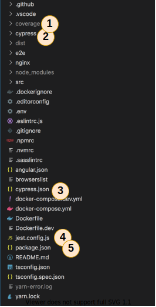

# Tools and setup

### Tools

Angular when created from angular cli by default configures **jasmine** for unit testing and **protractor** for e2e testing. Although both jasmine and protractor have default support from Angular core team, If we look at the Javascript community and ReactJS **Jest** is more popular for it's ease of using, it's batteries included philosophy and also community plugins.

Coming to protractor, it's a wrapper around the selenium web driver which is custom build for angular


it's named as protractor because angles are measured with protractor  


Although of those above advantages, protractor lacks the flexibility and the performance that lack testing  modern web apps. A very good alternative is **Cypress** which is an complete E2E testing platform which was built keeping a frontend/javascript developer in mind.

Both Jest and Cypress has a very active community and both their documentations are very good. Please go through them if you need more information regarding all the bells and whistles they bring to the testing eco-space.

#### Figure: Folder structure

1. Coverage folder is generated by jest which has html reports regarding the statements, functions covered and thresholds in a very good format.
2. Cypress folder contains all the information for the cypress like the tests, plugins, mocks. it has sub folders out of which integration folder is where we write the test cases.
3. cypress.json has the project specific configuration and the rest configuration would be set as default properties. In this file we can add more testing browsers, change base urls, environments
4.  jest.config.js, similarly to cypress we have this file for jest
5. package.json has test script modified to use Jest and a new script `npm run cypress` which runs cypress. there is still some more configuration needed here to run via CI/CD.

